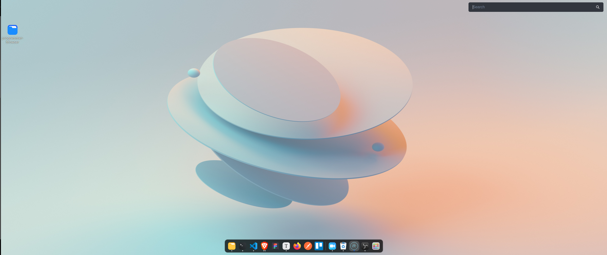
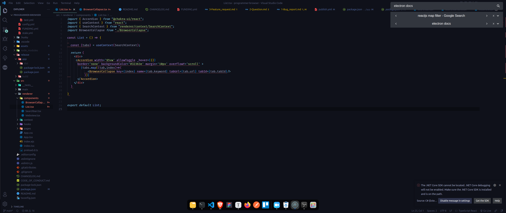
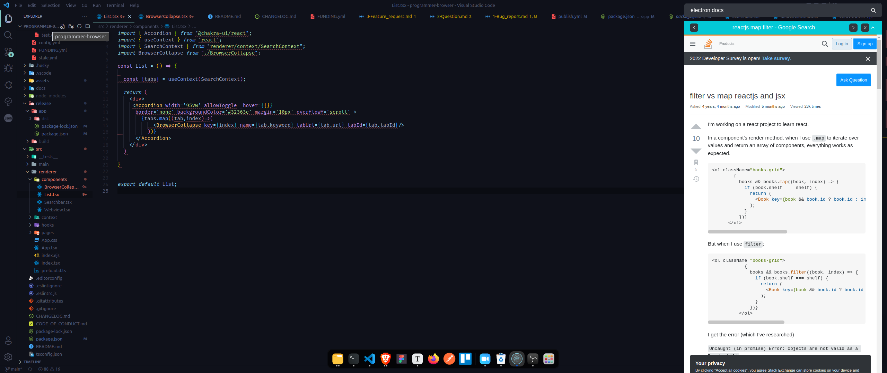
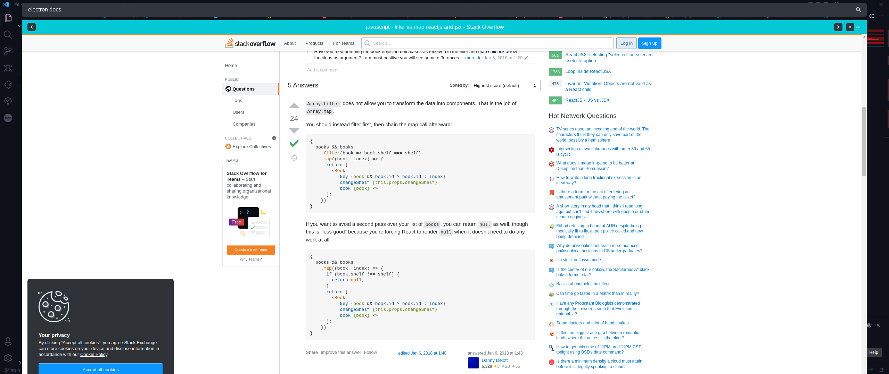

<p align="center">
  
</p>

# Programmer Browser

A fast-searching and space-saving browser specially designed for programmers.

#### :star: Support Us

If you like our project, do not forget to give stars. So we can get more attention and get more support from the community. Don't underestimate one star, one star you give will convince others to give the project another star.

#### :angel: Developer Advice

For a more comfortable use, I recommend that you take advantage of your operating system's ability to add shortcuts to the keyboard. With this feature, you can open and close the browser more easily.

#### :bulb: Feature Request

If there is a feature you need, please let me know by opening an issue. I will try to add this feature as soon as possible. But if you want, you can add the feature you want and contribute to the project.

## :muscle: Motivation

Hello, I am a programmer. And I need to speed dial while writing code. That's why standard browsers don't do much for me. My goal in this project is to create a useful browser that allows quick searches for programmers like me.

## :desktop_computer: Screenshots










[](https://www.youtube.com/watch?v=viSwzTKtArQ)

## :keyboard: Shortucts

| Shortcut Name           | Shortcut Keys      | Example                    |
| ----------------------- | ------------------ | -------------------------- |
| Full Screen             | F11                |                            |
| Change Search Engine    | Ctrl + E           |                            |
| Navigating between tabs | Ctrl + (index)     | Ctrl + 1 => Open First Tab |
| Window Move Left        | Ctrl + Left Arrow  |                            |
| Window Move Right       | Ctrl + Right Arrow |                            |
| Close All Tabs          | Alt + X            |                            |
| Close Other Tabs        | Alt + O            |                            |
| Close Current Tab       | Alt + T            |                            |
| Find In Tab             | Ctrl + F           |                            |

## :tada: Roadmap

- [x] Collapses

- [x] AdBlock

- [ ] Mute Collapse Audio

- [ ] Keyboard Shortcuts (Search/Control) (VIM/Emacs)

  - [x] Change Search Engine
  - [x] Navigating between tabs
  - [x] Close Tab
  - [x] Close All Tab
  - [x] Previous Page
  - [x] Next Page
  - [x] Close Other Tabs
  - [x] Close Current Tab
  - [x] Find In Tab
  - [ ] Mute Current Tab Audio

- [ ] Create Categories

- [ ] Context Menu

  - [ ] Right Click Open New Tab
  - [ ] Run Terminal Command (for: Linux)
  - [ ] Cut
  - [ ] Copy
  - [ ] Paste

- [ ] Set Tab Color

- [x] Refresh Collapse

- [ ] Add Electron Updater

  
## :crystal_ball: Usage

In the project directory, you can run:

```js
npm install (for first running)
npm start
```

Build Browser

```js
npm run package:linux
npm run package:mac
npm run package:windows
```

## :zap: How to Install .deb File

[](https://www.youtube.com/watch?v=H0FC6WZjqCc)

## :handshake: Contribute

Coming soon.
